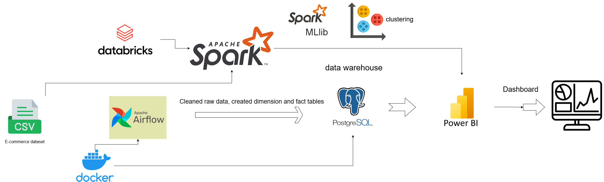

# 🛍️ E-commerce Sales Analytics Pipeline

## 📌 Description

This project builds a complete end-to-end data pipeline for analyzing e-commerce sales data. It uses **Apache Airflow** for ETL and scheduling, **PostgreSQL** as a data warehouse, **Spark on Databricks** for machine learning (customer segmentation), and **Power BI** for interactive visualizations.

---

## 🧱 Project Architecture


<!-- Make sure architecture.png is uploaded to your repo -->

---

## ⚙️ Tech Stack

- **Apache Airflow** (Docker) – for data pipeline automation
- **PostgreSQL** (Docker) – for storing cleaned data (dim & fact tables)
- **Apache Spark** (Databricks) – for K-Means clustering
- **Power BI** – for dashboard and business intelligence

---

## 📁 Workflow Steps

### 🔹 Step 1: Data Ingestion & Cleaning (Airflow)
- Download dataset from Kaggle
- Clean and preprocess data
- Create:
  - `dim_customer`
  - `dim_product`
  - `dim_date`
  - `fact_sales`
- Load structured data into PostgreSQL

### 🔹 Step 2: Customer Segmentation (Spark on Databricks)
- Perform K-Means clustering
- Segment customers based on purchase behavior

### 🔹 Step 3: Visualization (Power BI)
- Connect Power BI to PostgreSQL
- Visualize customer clusters and sales metrics

---

## 🧪 How to Use

1. **Clone the repository**

```bash
git clone https://github.com/aymanz12/ecommerce-analysis.git
cd ecommerce-analysis

